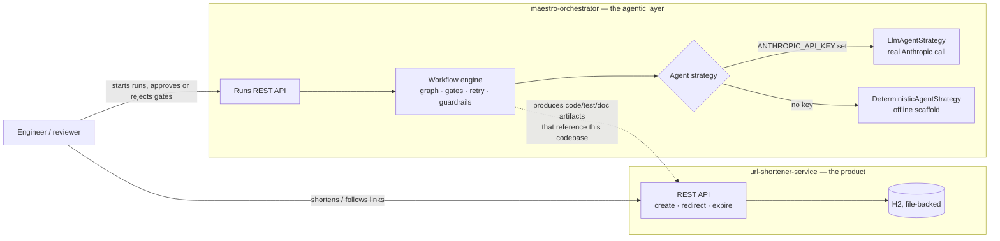
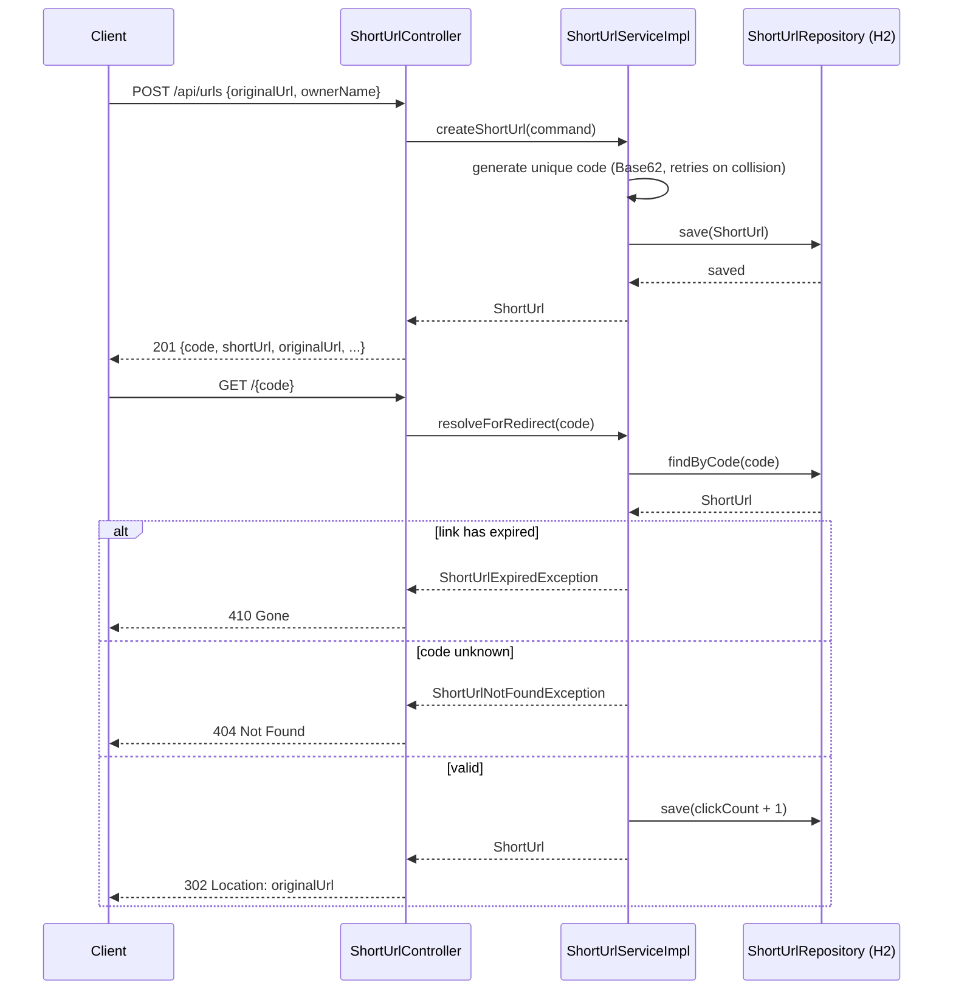
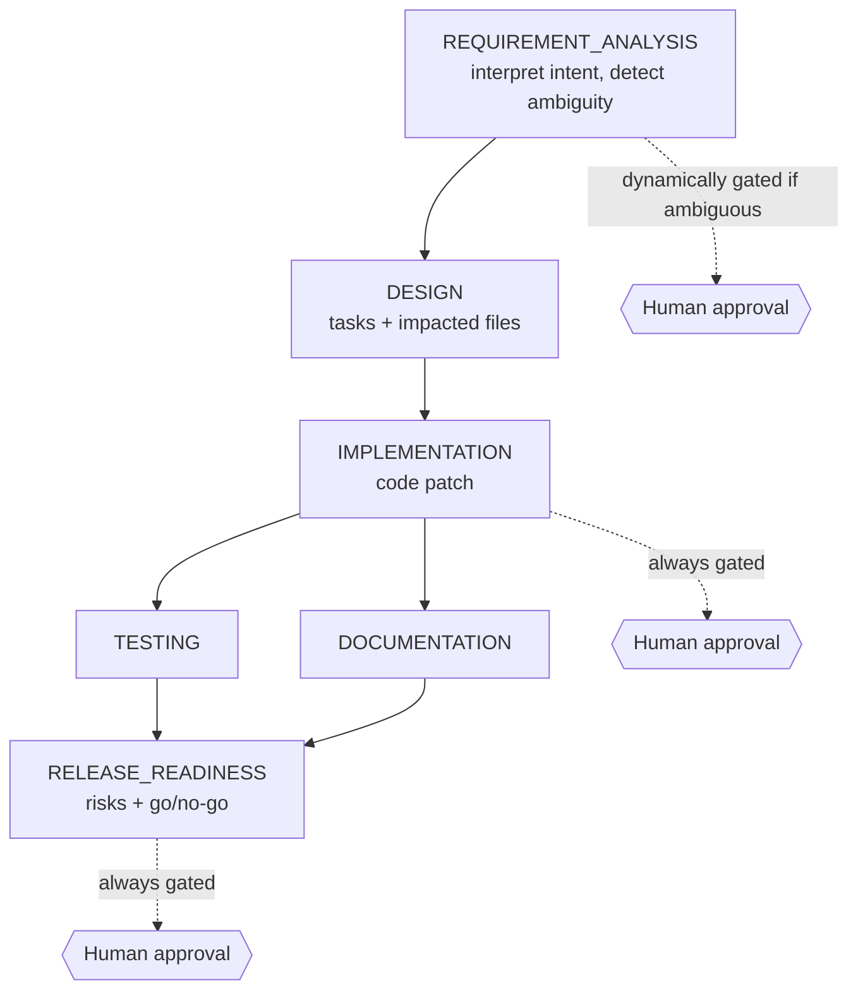
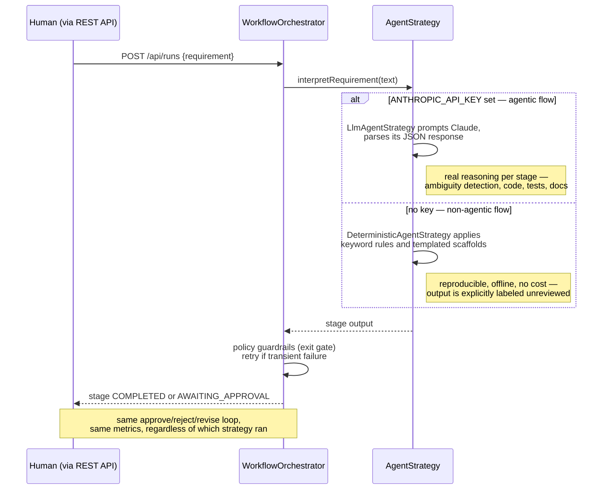

# Agentic URL Shortener

A Maven multi-module mono-repo with two parts:

- **[`url-shortener-service`](url-shortener-service/)** — the product. A
  Spring Boot URL shortener: create, redirect, expire.
- **[`maestro-orchestrator`](maestro-orchestrator/)** ("Maestro") — the
  agentic SDLC layer. It takes a plain-English requirement, decomposes it
  into a dependency-graphed workflow (requirements → design →
  implementation → testing/documentation → release-readiness), and
  executes that workflow with approval gates, retries, guardrails, and
  rollback — against `url-shortener-service` as its target codebase.

Full spec: [`docs/SPEC.md`](docs/SPEC.md). Black-box test suites (with
their own detail on what each scenario covers): [`e2e/README.md`](e2e/README.md).

## System overview



Maestro reasons about `url-shortener-service`'s code (e.g. which files an
"expired link" change would touch) and produces artifacts — it does not
currently write files or open a branch automatically; every stage's output
is reviewed through the approval gates before anything would be applied.

## `url-shortener-service`, in short

Create a short link, redirect through it, and have it expire — nothing
more. Google OAuth login exists but is strictly opt-in (off by default);
without it, a `ownerName` is just a client-supplied field.



Run it: `mvn -pl url-shortener-service -am spring-boot:run` (port 8080).
For OAuth: `SPRING_PROFILES_ACTIVE=oauth2 GOOGLE_CLIENT_ID=... GOOGLE_CLIENT_SECRET=... mvn ...`.

## `maestro-orchestrator`, in detail

### The use case

Maestro is the assignment's "critical differentiator": not a chatbot that
writes code, but an **orchestration layer** that coordinates a full SDLC
lifecycle with the same controls a real engineering process has —
dependency ordering, human approval on high-impact steps, bounded retries
on transient failures, policy guardrails, rollback on rejection, and an
audited decision trail. The thing being coordinated (interpreting a
requirement, designing an approach, writing code) is pluggable — Maestro
doesn't care whether that "thinking" comes from a real LLM or a
deterministic rule engine, which is the agentic/non-agentic split covered
below.

### The workflow graph



`TESTING` and `DOCUMENTATION` share `IMPLEMENTATION` as their only
dependency and both feed `RELEASE_READINESS` — the engine executes them
concurrently (real threads, not just a diagram) and only lets
`RELEASE_READINESS` become ready once both have finished, the
synchronization point the assignment brief calls for. A rejection or an
exhausted retry at any stage rolls that stage back, marks every
downstream stage `SKIPPED`, and safe-stops the run — nothing past the
failure point ever executes.

### How it's used

Everything goes through `maestro-orchestrator`'s REST API (port 8081):

```bash
# Start a run
curl -X POST http://localhost:8081/api/runs \
  -H "Content-Type: application/json" \
  -d '{"requirement":"Add an endpoint that generates a QR code for a short URL, requested by premaseem"}'
# -> { "id": "...", "statuses": { "IMPLEMENTATION": "AWAITING_APPROVAL", ... }, ... }

# Inspect what each stage actually produced
curl http://localhost:8081/api/runs/{id}/artifacts

# Approve (or reject with a reason, or revise a stage to re-plan)
curl -X POST http://localhost:8081/api/runs/{id}/stages/IMPLEMENTATION/approve
curl -X POST http://localhost:8081/api/runs/{id}/stages/IMPLEMENTATION/reject \
  -d '{"reason":"not what we want"}'
curl -X POST http://localhost:8081/api/runs/{id}/stages/DESIGN/revise \
  -d '{"note":"reconsider the approach"}'

# Reliability metrics: success rate, retry/rollback counts, MTTR, latency
curl http://localhost:8081/api/runs/{id}/metrics
```

A vague requirement (`"make it better"`) gates immediately at
`REQUIREMENT_ANALYSIS` with generated clarifying questions instead of
guessing; a requirement naming existing behavior (e.g. "expired links")
produces a `DESIGN` whose `impactedFiles` names real files in
`url-shortener-service` — that's the brownfield/ambiguous handling the
assignment asks for, and both are exercised live in
[`e2e/maestro.e2e.sh`](e2e/maestro.e2e.sh).

### Agentic vs. non-agentic flow

The engine (graph, gates, retries, guardrails, rollback, metrics) is
**identical** either way — only the "thinking" step at each stage
changes, selected automatically by whether `ANTHROPIC_API_KEY` is set:



The agent token is **optional by design**, not a missing feature: with no
key, Maestro runs the entire pipeline — including a live demo — on
`DeterministicAgentStrategy` with zero network dependency and zero cost.
Set `ANTHROPIC_API_KEY` and the exact same REST calls run the real
LLM-backed path instead; nothing else changes.

### Known limitations

Runs are in-memory only (reset on restart) and generated code is never
automatically written to disk or committed — both deliberate scope cuts
for this slice, not oversights. See `docs/SPEC.md` for the full picture.

Run it: `mvn -pl maestro-orchestrator -am spring-boot:run` (port 8081).

## Testing

```bash
mvn test              # 75 unit/component tests across both modules
./e2e/run-all.sh       # builds, starts, and black-box tests both services (40 assertions), then tears down
```

See [`e2e/README.md`](e2e/README.md) for what each e2e scenario covers.
